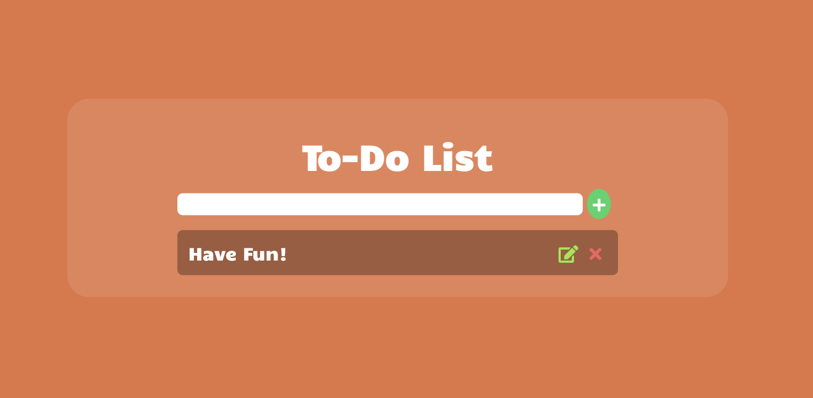
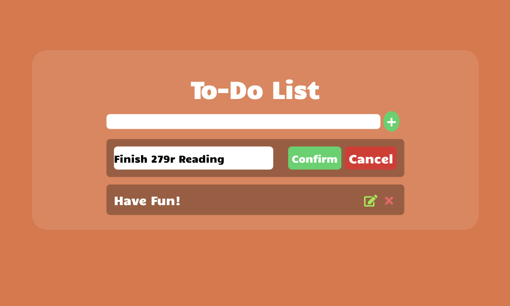

## A To Do Web App using MongoDB, Node.js




This project is adapted from a tutorial by [Diogo Pinheiro]([https://github.com/dhanishgajjar/js-to-do](https://medium.com/@diogo.fg.pinheiro/simple-to-do-list-app-with-node-js-and-mongodb-chapter-1-c645c7a27583)). In order to run the project locally, make sure that you have Node.js (and NPM) intalled.

### How to install Node.js

Links:

- [Node.js](https://nodejs.org/en/) homepage
- [NPM](https://www.npmjs.com/) homepage

Get Node.js and NPM (installed together):

- Debian / Ubuntu - based on [Node docs](https://github.com/nodesource/distributions/blob/master/README.md#installation-instructions).
- macOS - use a [Brew formula](https://formulae.brew.sh/formula/node).
    ```sh
    $ brew install node
    ```
- Windows
    - Download and run the Windows installer from the [Node.js Download](https://nodejs.org/en/download/) page.
- Other systems
    - Follow the [package manager](https://nodejs.org/en/download/package-manager/) instructions on the Node.js website.

Install Express, Mongoose, Ejs, and dotenv
```sh
npm install --save express mongoose ejs dotenv
```

Check installed versions:

- Node.js
    ```sh
    $ node --version
    v14.2.0
    ```
- NPM
   ```sh
   $ npm --version
   6.14.4
   ```
   
After cloning the repo and downloading the necessary packages, run 
```sh
npm start
```
and navigate to localhost:3000 to see the page locally.
